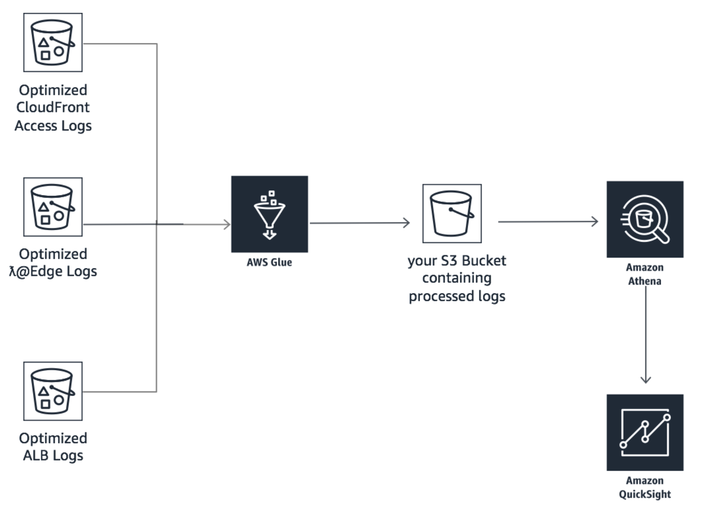

# LAB 1: Serverless Amazon CloudFront Log Analysis Pipeline

## Overview

## Architecture Diagram



## Create Amazon S3 Bucket

- Open the AWS Management console for Amazon S3 from [here](https://s3.console.aws.amazon.com/s3/home?region=eu-west-1)
- On the S3 Dashboard, Click on **Create Bucket.**


- In the **Create Bucket** pop-up page, input a unique **Bucket name**. Choose a large bucket name with many random characters and numbers (no spaces). You will need this Bucket name later in this exercise. 
  - Select the region as **EU (Ireland)**.
  - Click Next to navigate to next tab.
  - In the **Set properties** tab, leave all options as default.
  - In the **Set permissions** tag, leave all options as default.
  - In the **Review** tab, click on **Create Bucket**
  
  
 
## Creating Glue Data Catalog Database and Table using Amazon Athena

### Create Glue Data Catalog Database using Amazon Athena

- Open the AWS Management Console for Athena from [here](https://console.aws.amazon.com/athena/home).
- If this is your first time visiting the AWS Management Console for Athena, you will get a Getting Started page. Choose Get Started to open the Query Editor. If this isn't your first time, the Athena Query Editor opens.
- Make a note of the AWS region name, for example, for this lab you will need to choose the *EU (Ireland)* region.
- In the *Athena Query Editor*, you will see a query pane with an example query. Now you can start entering your query in the query pane.
- To create a database named reInvent2018_aws_service_logs, copy the following statement, and then choose Run Query:

```$xslt
CREATE DATABASE IF NOT EXISTS reInvent2018_aws_service_logs
```


- Ensure *reInvent2018_aws_service_logs* appears in the DATABASE list on the Catalog dashboard

## Create Glue Data Catalog for CloudFront Access Logs in optimized Parquet Format

- Ensure that current AWS region is **EU (Ireland)** region
- Ensure *reInvent2018_aws_service_logs* is selected from the DATABASE list and then choose New Query.
- In the query pane, copy the following statement to create a the *cf_access_optimized* table, and then choose **Run Query**:

```$xslt
CREATE EXTERNAL TABLE IF NOT EXISTS reInvent2018_aws_service_logs.cf_access_optimized(
                time timestamp,
                location string,
                bytes bigint,
                requestip string,
                method string,
                host string,
                uri string,
                status int,
                referrer string,
                useragent string,
                querystring string,
                cookie string,
                resulttype string,
                requestid string,
                hostheader string,
                requestprotocol string,
                requestbytes bigint,
                timetaken double,
                xforwardedfor string,
                sslprotocol string,
                sslcipher string,
                responseresulttype string,
                httpversion string)
PARTITIONED BY (
                year string,
                month string,
                day string)
ROW FORMAT SERDE 'org.apache.hadoop.hive.ql.io.parquet.serde.ParquetHiveSerDe'
STORED AS PARQUET
LOCATION 's3://us-east-1.data-analytics/cflogworkshop/optimized/cf-accesslogs'
TBLPROPERTIES("parquet.compress"="SNAPPY")
```


Now that you have created the table you need to add the partition metadata to the AWS Glue Data Catalog.

Choose **New Query**, copy the following statement into the query pane, and then choose **Run Query** to add partition metadata

```$xslt
MSCK REPAIR TABLE reInvent2018_aws_service_logs.cf_access_optimized
```

- Get the total number of CloudFront Access Log records:

```$xslt
SELECT count(*) AS rowcount FROM reInvent2018_aws_service_logs.cf_access_optimized
```

- Get the first ten records:

```$xslt
SELECT * FROM reInvent2018_aws_service_logs.cf_access_optimized LIMIT 10
```

*After a few seconds, Athena will display your query results as shown below:*


## Create Glue Data Catalog for Application Load Balancer(ALB) Access Logs in optimized Parquet Format

In the query pane, copy the following statement to create a the **alb_access_optimized** table, and then choose **Run Query**:

```$xslt
CREATE EXTERNAL TABLE IF NOT EXISTS reInvent2018_aws_service_logs.alb_access_optimized(
                type string,
                time timestamp,
                elb string,
                client_ip_port string,
                target_ip_port string,
                request_processing_time double,
                target_processing_time double,
                response_processing_time double,
                elb_status_code string,
                target_status_code string,
                received_bytes bigint,
                sent_bytes bigint,
                request_verb string,
                request_url string,
                request_proto string,
                user_agent string,
                ssl_cipher string,
                ssl_protocol string,
                target_group_arn string,
                trace_id string,
                domain_name string,
                chosen_cert_arn string)
PARTITIONED BY (
                region string,
                year string,
                month string,
                day string)
ROW FORMAT SERDE 'org.apache.hadoop.hive.ql.io.parquet.serde.ParquetHiveSerDe'
STORED AS PARQUET
LOCATION 's3://eu-west-1.data-analytics/cflogworkshop/optimized/lblogs'
TBLPROPERTIES("parquet.compress"="SNAPPY")
```

Now that you have created the table you need to add the partition metadata to the AWS Glue Catalog.

- Choose **New Query**, copy the following statement into the query pane, and then choose **Run Query** to add partition metadata.

```$xslt
MSCK REPAIR TABLE reInvent2018_aws_service_logs.alb_access_optimized
```

- Get the total number of ALB Access Log records:

```$xslt
SELECT count(*) AS rowcount FROM reInvent2018_aws_service_logs.alb_access_optimized
```

- Get the first ten records:

```$xslt
SELECT * FROM reInvent2018_aws_service_logs.alb_access_optimized LIMIT 10
```

After a few seconds, Athena will display your query results as shown below:


## Create Glue Data Catalog for Lambda@Edge Logs - Viewer Request in optimized Parquet Format

In the query pane, copy the following statement to create a the *lambdaedge_logs_viewer_request_optimized* table, and then choose **Run Query**:

```$xslt
CREATE EXTERNAL TABLE IF NOT EXISTS reInvent2018_aws_service_logs.lambdaedge_logs_viewer_request_optimized(
                executionregion string,
                requestid string,
                distributionid string,
                distributionname string,
                eventtype string,
                requestdata string,
                customtraceid string,
                useragentstring string)
PARTITIONED BY (
                year string,
                month string,
                date string,
                hour string)
ROW FORMAT SERDE 'org.apache.hadoop.hive.ql.io.parquet.serde.ParquetHiveSerDe'
STORED AS PARQUET
LOCATION 's3://eu-west-1.data-analytics/cflogworkshop/optimized/lelogs/viewer-request'
TBLPROPERTIES("parquet.compress"="SNAPPY")
```

Now that you have created the table you need to add the partition metadata to the AWS Glue Catalog.

- Choose **New Query**, copy the following statement into the query pane, and then choose **Run Query** to add partition metadata.

```$xslt
MSCK REPAIR TABLE reInvent2018_aws_service_logs.lambdaedge_logs_viewer_request_optimized
```

- Get the total number of Lambda@Edge Log - Viewer Request records:

```$xslt
SELECT count(*) AS rowcount FROM reInvent2018_aws_service_logs.lambdaedge_logs_viewer_request_optimized
```

- Get the first ten records:

```$xslt
SELECT * FROM reInvent2018_aws_service_logs.lambdaedge_logs_viewer_request_optimized LIMIT 10
```

After a few seconds, Athena will display your query results as shown below:


## Create Glue Data Catalog for Lambda@Edge Logs - Origin Request in optimized Parquet Format

In the query pane, copy the following statement to create a the *lambdaedge_logs_origin_request_optimized* table, and then choose **Run Query**:

```$xslt
CREATE EXTERNAL TABLE IF NOT EXISTS reInvent2018_aws_service_logs.lambdaedge_logs_origin_request_optimized(
    executionregion string, 
    requestid string, 
    distributionid string, 
    distributionname string, 
    eventtype string, 
    requestdata string, 
    customtraceid string,
    viewercountry string,
    deviceformfactor string)
PARTITIONED BY ( 
    year string, 
    month string, 
    date string, 
    hour string)
ROW FORMAT SERDE 'org.apache.hadoop.hive.ql.io.parquet.serde.ParquetHiveSerDe' 
STORED AS PARQUET
LOCATION 's3://eu-west-1.data-analytics/cflogworkshop/optimized/lelogs/origin-request'
TBLPROPERTIES("parquet.compress"="SNAPPY")
```

Now that you have created the table you need to add the partition metadata to the AWS Glue Catalog.

- Choose **New Query**, copy the following statement into the query pane, and then choose **Run Query** to add partition metadata.

```$xslt
MSCK REPAIR TABLE reInvent2018_aws_service_logs.lambdaedge_logs_origin_request_optimized
```

- Get the total number of Lambda@Edge Log - Viewer Request records:

```$xslt
SELECT count(*) AS rowcount FROM reInvent2018_aws_service_logs.lambdaedge_logs_origin_request_optimized
```

- Get the first ten records:

```$xslt
SELECT * FROM reInvent2018_aws_service_logs.lambdaedge_logs_origin_request_optimized LIMIT 10
```

## Create AWS IAM Role

Create an IAM role that has permission to your Amazon S3 sources, targets, temporary directory, scripts, AWSGlueServiceRole and any libraries used by the job.

- Open the AWS Management console for AWS IAM from [here](https://console.aws.amazon.com/iam/home?region=us-west-2#/roles)
- On the IAM **Role** page click on **Create role**
- Choose **Glue** under **Choose the service that will use this role section**
- Ensure that **Glue** is shown under the **Select your use case** section 
- Click on **Next:Permissions** on the bottom
- On the Attach permissions policies, search policies for S3 and check the box for **AmazonS3FullAccess**

> **Note**: Do not click on the policy, you just have to check the corresponding checkbox

- On the same page, now search policies for Glue and check the box for *AWSGlueConsoleFullAccess* and *AWSGlueServiceRole*.

> **Note**: Do not click on the policy, you just have to check the corresponding checkbox

- Click on **Next:Review**
- Type the **Role name** *(e.g. ReInvent2018-CTD410-GlueRole)*
- Type the **Role description** (optional)
- Ensure that **AmazonS3FullAccess**, **AWSGlueConsoleFullAccess** and **AWSGlueServiceRole** are listed under policies
- Click **Create role**

## Create AWS Glue ETL Job

- Open the AWS Management console for AWS Glue service from [here](https://eu-west-1.console.aws.amazon.com/glue/home?region=eu-west-1)
- If this is your first time visiting the AWS Management Console for AWS Glue, you will get a Getting Started page. Choose **Get Started**. If this isn't your first time, the **Tables** pages opens.
- Make a note of the AWS region name, for example, for this lab you will need to choose the *eu-west-1 (Ireland) *region
- Click on **Jobs** under the *ETL *section in the navigation pane on the left
- Click on **Add job** to create a new ETL job to join the Amazon CloudFront access logs, Lambda@Edge(viewer-request and origin-request) logs and Application Load Balancer logs
- On the **Job properties** page, type the **Name** *(e.g. ReInvent2018-CTD410-LogCombiner)* of the AWS Glue ETL job
- Choose the **IAM role** you created *(e.g. ReInvent2018-CTD410-GlueRole)* as part of the previous section in this lab from the drop down menu
- Select **A new script to be authored by you** for **This job runs**
- Select **Python** as the **ETL language**
- Click **Next**
- On the **Connections** page, click **Next**
- On the **Review** page, click **Save job and edit script**
- If this your first time, a **Script editor tips** page will pop up. Close the pop up page by clicking on the *x *symbol on the top right
- Copy and paste the LogCombiner script [log-combiner-glue-script.py](./log-combiner-glue-script.py) to AWS Glue script editor pane
- Replace the place holder *<your-s3-bucket>* with the name of the Amazon S3 bucket your created at the beginning of this lab

> **Note:** This step may take from upto 15 minutes to complete. 

- Click **Save**
- Click **Run**
- Click **Run job** on the popped up **Parameters(optional)** page
- Close the script editor page by click on **X** symbol on the right hand side of the page 
- On the Jobs pages check the box next to the name of the Glue ETL job *(e.g. ReInvent2018-CTD410-LogCombiner)* *to view the current status of the job under the **History** tab at the bottom of the page
- Ensure that the *Run status *is displaced as **Running**
- Wait until the Run status changes to **Succeeded** 

> **Note:** This step may take from upto 15 minutes to complete.

## Create AWS Glue Data Catalog for the combined Lamabda@Eddge logs using Amazon Athena

- Open the AWS Management Console for Athena from [here](https://console.aws.amazon.com/athena/home).
- In the query pane, copy the following statement to create a the *lambdaedge_logs_combined_optimized* table, and then choose **Run Query**:

> **Note:** Replace <your-bucket-name> in the query below with the unique name of the S3 Bucket you created in step 1 earlier.

```$xslt
CREATE EXTERNAL TABLE IF NOT EXISTS reInvent2018_aws_service_logs.lambdaedge_logs_combined_optimized(
                executionregion string,
                requestid string,
                distributionid string,
                distributionname string,
                requestdata string,
                customtraceid string,
                useragentstring string,
                deviceformfactor string,
                viewercountry string)
PARTITIONED BY (
                year string,
                month string,
                date string,
                hour string)
ROW FORMAT SERDE 'org.apache.hadoop.hive.ql.io.parquet.serde.ParquetHiveSerDe'
STORED AS PARQUET
LOCATION 's3://<your-bucket-name>/combined/lelogs/'
TBLPROPERTIES("parquet.compress"="SNAPPY")
```

Now that you have created the table you need to add the partition metadata to the AWS Glue Catalog.

1. Choose **New Query**, copy the following statement into the query pane, and then choose **Run Query** to add partition metadata.

```$xslt
MSCK REPAIR TABLE reInvent2018_aws_service_logs.lambdaedge_logs_combined_optimized
```

- Get the total number of combined Lambda@Edge Log records:

```$xslt
SELECT count(*) AS rowcount FROM reInvent2018_aws_service_logs.lambdaedge_logs_combined_optimized
```

- Get the first ten records:
```$xslt
SELECT * FROM reInvent2018_aws_service_logs.lambdaedge_logs_combined_optimized LIMIT 10
```
## Create AWS Glue Data Catalog for the combined logs using Amazon Athena
- In the query pane, copy the following statement to create a the *combined_log_optimized* table, and then choose **Run Query*:

> **Note:** Replace <your-bucket-name> in the query below with the unique name of the S3 Bucket you created in step 1 earlier.

```$xslt
CREATE EXTERNAL TABLE reInvent2018_aws_service_logs.combined_log_optimized(
                received_bytes int,
                trace_id string,
                distributionname string,
                executionregion string,
                distributionid string,
                location string,
                sent_bytes int,
                responseresulttype string,
                xforwardedfor string,
                type string,
                customtraceid string,
                querystring string,
                client_ip_port string,
                response_processing_time double,
                elb string,
                deviceformfactor string,
                elb_status_code string,
                uri string,
                request_verb string,
                col24 string,
                request_url string,
                region string,
                hostheader string,
                request_processing_time double,
                resulttype string,
                method string,
                useragent string,
                httpversion string,
                target_status_code string,
                target_ip_port string,
                requestdata string,
                host string,
                referrer string,
                cookie string,
                bytes bigint,
                target_processing_time double,
                alb_time timestamp,
                requestid string,
                viewercountry string,
                timetaken double,
                requestbytes bigint,
                target_group_arn string,
                sslprotocol string,
                requestprotocol string,
                status int,
                time timestamp,
                requestip string,
                sslcipher string,
                request_proto string,
                col25 string,
                user_agent string)
PARTITIONED BY (
                year string,
                month string,
                day string)
ROW FORMAT SERDE 'org.apache.hadoop.hive.ql.io.parquet.serde.ParquetHiveSerDe'
STORED AS PARQUET
LOCATION 's3://<your-bucket-name>/combined/logs/'
TBLPROPERTIES("parquet.compress"="SNAPPY")
```

Now that you have created the table you need to add the partition metadata to the AWS Glue Catalog.

- Choose **New Query**, copy the following statement into the query pane, and then choose **Run Query** to add partition metadata.

```$xslt
MSCK REPAIR TABLE reInvent2018_aws_service_logs.combined_log_optimized
```
- Get the total number of combined log records:

```$xslt
SELECT count(*) AS rowcount FROM reInvent2018_aws_service_logs.combined_log_optimized
```

- Get the first ten records:

```$xslt
SELECT * FROM reInvent2018_aws_service_logs.combined_log_optimized LIMIT 10
```

## License Summary

This sample code is made available under a modified MIT license. See the LICENSE file.