# LAB 1: Serverless Amazon CloudFront Log Analysis Pipeline

## Overview

### Log collection
  

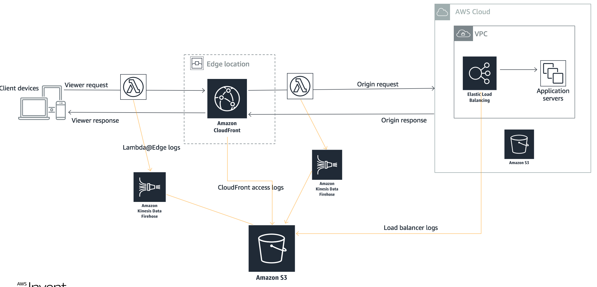

As part of the log data generation generation, the following four different logs have been collected

|Log Name|Raw Log Location|Format|Log Entries|
|---|----|---|-----|
|Viewer request triggered Lambda@Edge logs|aws s3 ls s3://eu-west-1.data-analytics/raw/lelogs/viewer-request/|JSON|{executionregion, requestid, distributionid, distributionname, eventtype, requestdata, customtraceid, useragentstring}| 
|Amazon CloudFront access logs|aws s3 ls s3://eu-west-1.data-analytics/raw/cf-accesslogs/|CSV|[Web Distribution Log File Format](https://docs.aws.amazon.com/AmazonCloudFront/latest/DeveloperGuide/AccessLogs.html#BasicDistributionFileFormat)|
|Origin request triggered Lambda@Edge logs|aws s3 ls s3://eu-west-1.data-analytics/raw/lelogs/origin-request/|JSON|{executionregion, requestid, distributionid, distributionname, eventtype, requestdata, customtraceid, viewercountry, deviceformfactor}|
|Application Load Balancer(ALB) logs|aws s3 ls s3://eu-west-1.data-analytics/raw/lblogs/|JSON|[Access Log Entries](https://docs.aws.amazon.com/elasticloadbalancing/latest/application/load-balancer-access-logs.html#access-log-entry-format)|


### Lab Overview 

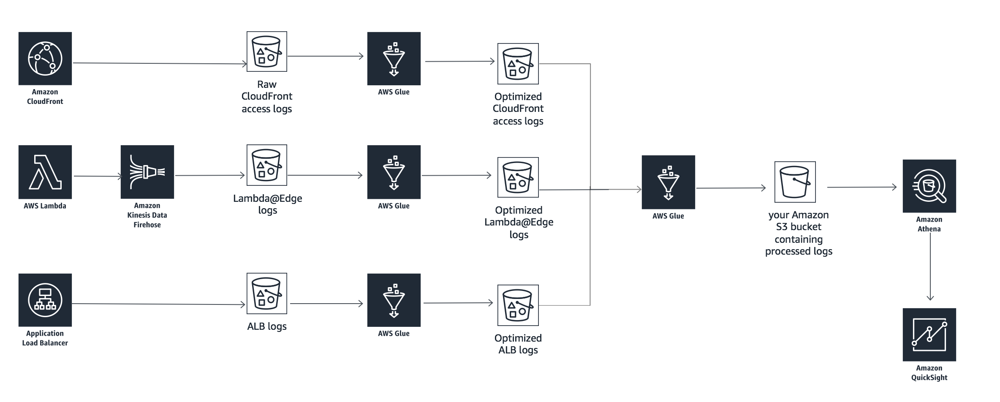

In this lab, you are going to build a serverless architecture to combine all the four logs - 1) Viewer request triggered Lambda@Edge logs, 2) Origin request triggered Lambda@Edge logs, 3) Amazon CloudFront access logs and 4) Application Load Balancer(ALB) logs using AWS Glue and then analyze the combined logs using Amazon Athena and visualize in Amazon QuickSight. The logs you are going to use is already converter from raw logs in CSV or JSON format to optimized logs into partition and compresses parquet format. 

|Log Name|Partition|Conversion Script|Github|Optimized Log Location|
|---|----|---|---|---|
|Viewer request triggered Lambda@Edge logs|year, month, day, hour|[lelogconverter.py](./lelogconverter.py)|-|aws s3 ls s3://eu-west-1.data-analytics/cflogworkshop/optimized/lelogs/viewer-request/|
|Amazon CloudFront access logs|year, month, day|[sample_cloudfront_job.py](https://github.com/awslabs/athena-glue-service-logs/blob/master/scripts/sample_cloudfront_job.py)|[Link](https://github.com/awslabs/athena-glue-service-logs)|aws s3 ls s3://us-east-1.data-analytics/cflogworkshop/optimized/cf-accesslogs/|
|Origin request triggered Lambda@Edge logs|year, month, day, hour|[lelogconverter.py](./lelogconverter.py)|-|aws s3 ls s3://eu-west-1.data-analytics/cflogworkshop/optimized/lelogs/origin-request/|
|Application Load Balancer(ALB) logs|region, year, month, day|[sample_alb_job.py](https://github.com/awslabs/athena-glue-service-logs/blob/master/scripts/sample_alb_job.py)|[Link](https://github.com/awslabs/athena-glue-service-logs)|aws s3 ls s3://eu-west-1.data-analytics/cflogworkshop/optimized/lblogs/|

## Lambda @ Edge

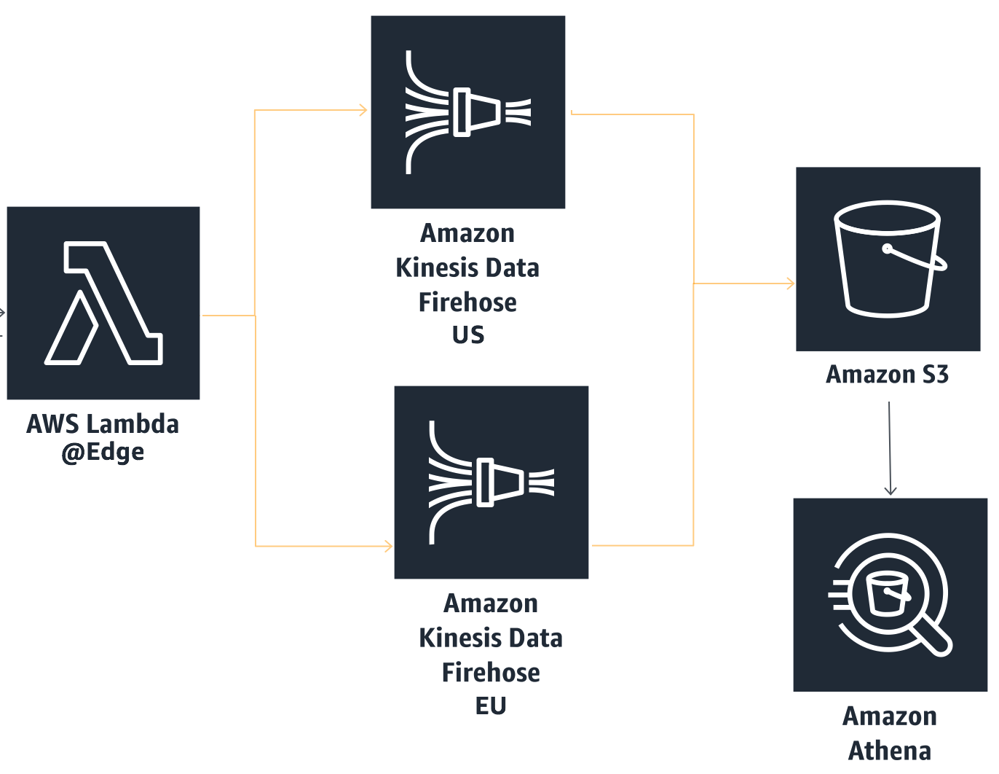

|EventType|Script|
|---|----|
|Viewer Request|[index.js](./viewerRequest-Lambda/index.js)|
|Origin Request|[index.js](./originRequest-Lambda/index.js)|

## Create Amazon S3 Bucket

- Open the AWS Management console for Amazon S3 from [here](https://s3.console.aws.amazon.com/s3/home?region=eu-west-1)
- On the S3 Dashboard, Click on **Create Bucket.**

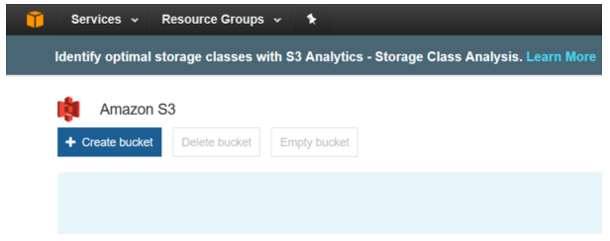

- In the **Create Bucket** pop-up page, input a unique **Bucket name**. Choose a large bucket name with many random characters and numbers (no spaces). You will need this Bucket name later in this exercise. 
  - Select the region as **EU (Ireland)**.
  - Click Next to navigate to next tab.
  - In the **Configure Options** tab, leave all options as default.
  - In the **Set permissions** tag, leave all options as default.
  - In the **Review** tab, click on **Create Bucket**
  
 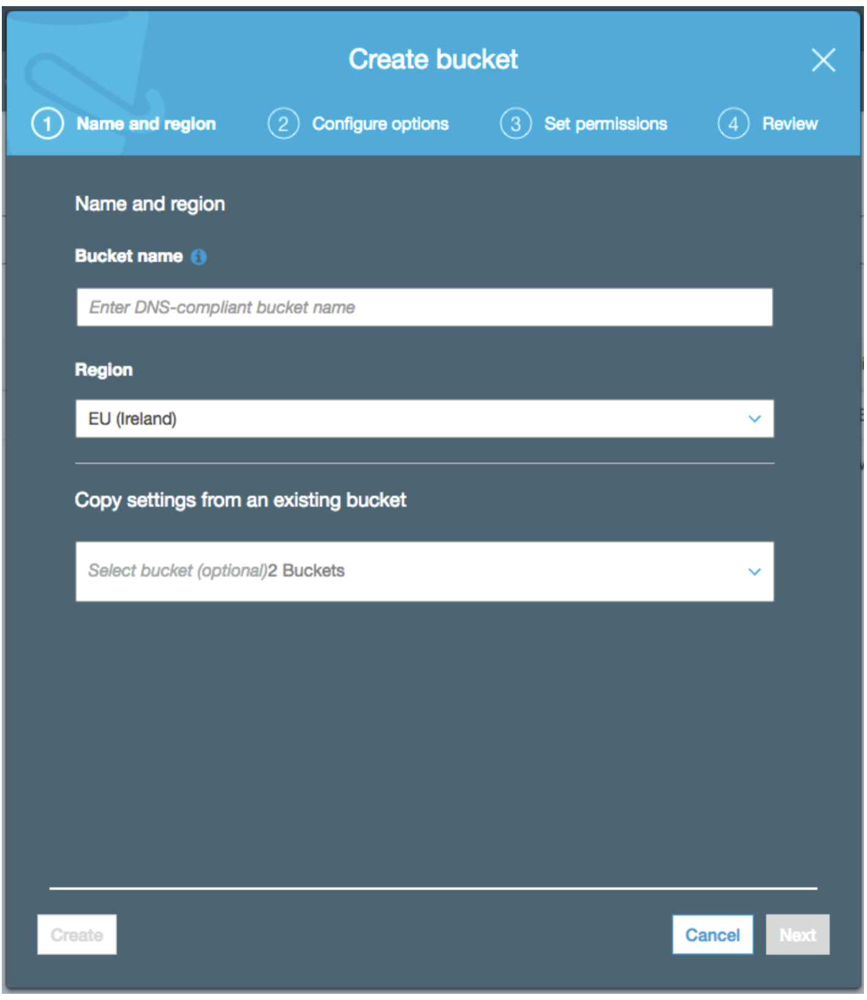 
 
## Creating Glue Data Catalog Database and Table using Amazon Athena

### Create Glue Data Catalog Database using Amazon Athena

- Open the AWS Management Console for Athena from [here](https://console.aws.amazon.com/athena/home).
- If this is your first time visiting the AWS Management Console for Athena, you will get a Getting Started page. Choose Get Started to open the Query Editor. If this isn't your first time, the Athena Query Editor opens.
- Make a note of the AWS region name, for example, for this lab you will need to choose the *EU (Ireland)* region.
- In the *Athena Query Editor*, you will see a query pane with an example query. Now you can start entering your query in the query pane.
- To create a database named reInvent2018_aws_service_logs, copy the following statement, and then choose Run Query:

```$xslt
CREATE DATABASE IF NOT EXISTS reInvent2018_aws_service_logs
```

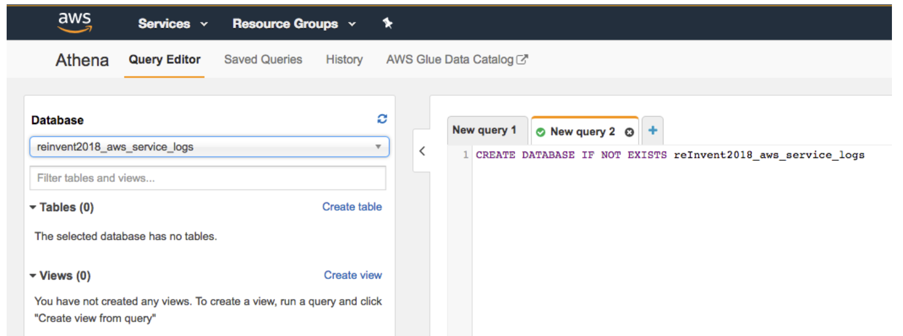

- Ensure *reInvent2018_aws_service_logs* appears in the DATABASE list on the Catalog dashboard

## Create Glue Data Catalog for CloudFront Access Logs in optimized Parquet Format

- Ensure that current AWS region is **EU (Ireland)** region
- Ensure *reInvent2018_aws_service_logs* is selected from the DATABASE list and then choose New Query.
- In the query pane, copy the following statement to create a the *cf_access_optimized* table, and then choose **Run Query**:

```$xslt
CREATE EXTERNAL TABLE IF NOT EXISTS reInvent2018_aws_service_logs.cf_access_optimized(
                time timestamp,
                location string,
                bytes bigint,
                requestip string,
                method string,
                host string,
                uri string,
                status int,
                referrer string,
                useragent string,
                querystring string,
                cookie string,
                resulttype string,
                requestid string,
                hostheader string,
                requestprotocol string,
                requestbytes bigint,
                timetaken double,
                xforwardedfor string,
                sslprotocol string,
                sslcipher string,
                responseresulttype string,
                httpversion string)
PARTITIONED BY (
                year string,
                month string,
                day string)
ROW FORMAT SERDE 'org.apache.hadoop.hive.ql.io.parquet.serde.ParquetHiveSerDe'
STORED AS PARQUET
LOCATION 's3://us-east-1.data-analytics/cflogworkshop/optimized/cf-accesslogs'
TBLPROPERTIES("parquet.compress"="SNAPPY")
```

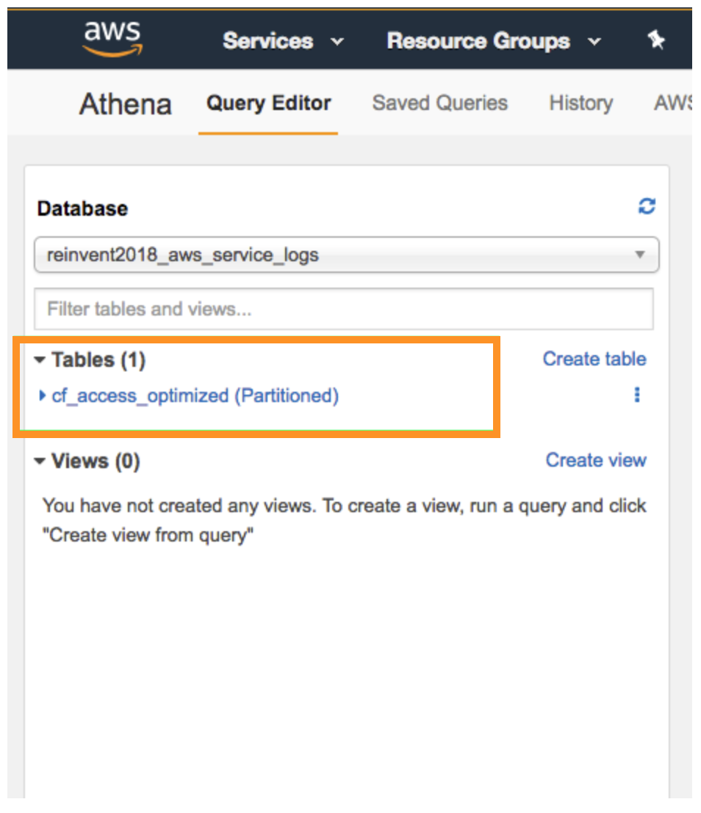

Now that you have created the table you need to add the partition metadata to the AWS Glue Data Catalog.

Choose **New Query**, copy the following statement into the query pane, and then choose **Run Query** to add partition metadata

```$xslt
MSCK REPAIR TABLE reInvent2018_aws_service_logs.cf_access_optimized
```

- Get the total number of CloudFront Access Log records:

```$xslt
SELECT count(*) AS rowcount FROM reInvent2018_aws_service_logs.cf_access_optimized
```

- Get the first ten records:

```$xslt
SELECT * FROM reInvent2018_aws_service_logs.cf_access_optimized LIMIT 10
```

*After a few seconds, Athena will display your query results as shown below:*

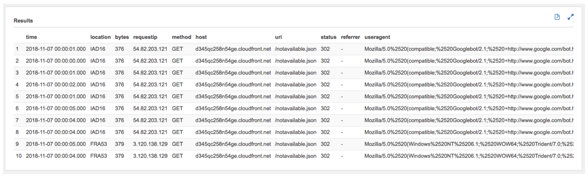

## Create Glue Data Catalog for Application Load Balancer(ALB) Access Logs in optimized Parquet Format

In the query pane, copy the following statement to create a the **alb_access_optimized** table, and then choose **Run Query**:

```$xslt
CREATE EXTERNAL TABLE IF NOT EXISTS reInvent2018_aws_service_logs.alb_access_optimized(
                type string,
                time timestamp,
                elb string,
                client_ip_port string,
                target_ip_port string,
                request_processing_time double,
                target_processing_time double,
                response_processing_time double,
                elb_status_code string,
                target_status_code string,
                received_bytes bigint,
                sent_bytes bigint,
                request_verb string,
                request_url string,
                request_proto string,
                user_agent string,
                ssl_cipher string,
                ssl_protocol string,
                target_group_arn string,
                trace_id string,
                domain_name string,
                chosen_cert_arn string)
PARTITIONED BY (
                region string,
                year string,
                month string,
                day string)
ROW FORMAT SERDE 'org.apache.hadoop.hive.ql.io.parquet.serde.ParquetHiveSerDe'
STORED AS PARQUET
LOCATION 's3://eu-west-1.data-analytics/cflogworkshop/optimized/lblogs'
TBLPROPERTIES("parquet.compress"="SNAPPY")
```

Now that you have created the table you need to add the partition metadata to the AWS Glue Catalog.

- Choose **New Query**, copy the following statement into the query pane, and then choose **Run Query** to add partition metadata.

```$xslt
MSCK REPAIR TABLE reInvent2018_aws_service_logs.alb_access_optimized
```

- Get the total number of ALB Access Log records:

```$xslt
SELECT count(*) AS rowcount FROM reInvent2018_aws_service_logs.alb_access_optimized
```

- Get the first ten records:

```$xslt
SELECT * FROM reInvent2018_aws_service_logs.alb_access_optimized LIMIT 10
```

After a few seconds, Athena will display your query results as shown below:

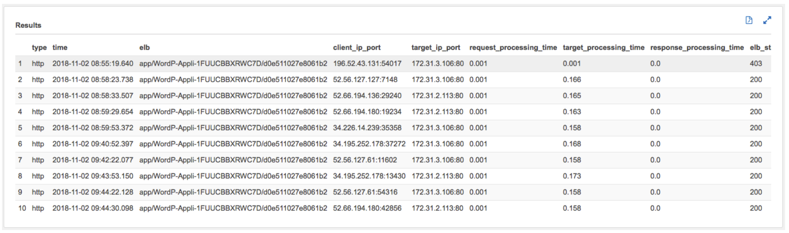

## Create Glue Data Catalog for Lambda@Edge Logs - Viewer Request in optimized Parquet Format

In the query pane, copy the following statement to create a the *lambdaedge_logs_viewer_request_optimized* table, and then choose **Run Query**:

```$xslt
CREATE EXTERNAL TABLE IF NOT EXISTS reInvent2018_aws_service_logs.lambdaedge_logs_viewer_request_optimized(
                executionregion string,
                requestid string,
                distributionid string,
                distributionname string,
                eventtype string,
                requestdata string,
                customtraceid string,
                useragentstring string)
PARTITIONED BY (
                year string,
                month string,
                date string,
                hour string)
ROW FORMAT SERDE 'org.apache.hadoop.hive.ql.io.parquet.serde.ParquetHiveSerDe'
STORED AS PARQUET
LOCATION 's3://eu-west-1.data-analytics/cflogworkshop/optimized/lelogs/viewer-request'
TBLPROPERTIES("parquet.compress"="SNAPPY")
```

Now that you have created the table you need to add the partition metadata to the AWS Glue Catalog.

- Choose **New Query**, copy the following statement into the query pane, and then choose **Run Query** to add partition metadata.

```$xslt
MSCK REPAIR TABLE reInvent2018_aws_service_logs.lambdaedge_logs_viewer_request_optimized
```

- Get the total number of Lambda@Edge Log - Viewer Request records:

```$xslt
SELECT count(*) AS rowcount FROM reInvent2018_aws_service_logs.lambdaedge_logs_viewer_request_optimized
```

- Get the first ten records:

```$xslt
SELECT * FROM reInvent2018_aws_service_logs.lambdaedge_logs_viewer_request_optimized LIMIT 10
```

After a few seconds, Athena will display your query results as shown below:

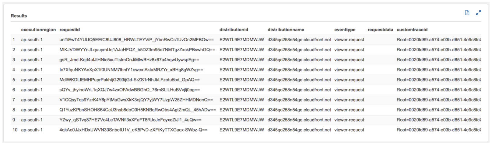

## Create Glue Data Catalog for Lambda@Edge Logs - Origin Request in optimized Parquet Format

In the query pane, copy the following statement to create a the *lambdaedge_logs_origin_request_optimized* table, and then choose **Run Query**:

```$xslt
CREATE EXTERNAL TABLE IF NOT EXISTS reInvent2018_aws_service_logs.lambdaedge_logs_origin_request_optimized(
    executionregion string, 
    requestid string, 
    distributionid string, 
    distributionname string, 
    eventtype string, 
    requestdata string, 
    customtraceid string,
    viewercountry string,
    deviceformfactor string)
PARTITIONED BY ( 
    year string, 
    month string, 
    date string, 
    hour string)
ROW FORMAT SERDE 'org.apache.hadoop.hive.ql.io.parquet.serde.ParquetHiveSerDe' 
STORED AS PARQUET
LOCATION 's3://eu-west-1.data-analytics/cflogworkshop/optimized/lelogs/origin-request'
TBLPROPERTIES("parquet.compress"="SNAPPY")
```

Now that you have created the table you need to add the partition metadata to the AWS Glue Catalog.

- Choose **New Query**, copy the following statement into the query pane, and then choose **Run Query** to add partition metadata.

```$xslt
MSCK REPAIR TABLE reInvent2018_aws_service_logs.lambdaedge_logs_origin_request_optimized
```

- Get the total number of Lambda@Edge Log - Viewer Request records:

```$xslt
SELECT count(*) AS rowcount FROM reInvent2018_aws_service_logs.lambdaedge_logs_origin_request_optimized
```

- Get the first ten records:

```$xslt
SELECT * FROM reInvent2018_aws_service_logs.lambdaedge_logs_origin_request_optimized LIMIT 10
```

## Create AWS IAM Role

Create an IAM role that has permission to your Amazon S3 sources, targets, temporary directory, scripts, AWSGlueServiceRole and any libraries used by the job.

- Open the AWS Management console for AWS IAM from [here](https://console.aws.amazon.com/iam/home?region=us-west-2#/roles)
- On the IAM **Role** page click on **Create role**
- Choose **Glue** under **Choose the service that will use this role section**
- Ensure that **Glue** is shown under the **Select your use case** section 
- Click on **Next:Permissions** on the bottom
- On the Attach permissions policies, search policies for S3 and check the box for **AmazonS3FullAccess**

> **Note**: Do not click on the policy, you just have to check the corresponding checkbox

- On the same page, now search policies for Glue and check the box for *AWSGlueConsoleFullAccess* and *AWSGlueServiceRole*.

> **Note**: Do not click on the policy, you just have to check the corresponding checkbox

- Click on **Next:Review**
- Type the **Role name** *(e.g. ReInvent2018-CTD410-GlueRole)*
- Type the **Role description** (optional)
- Ensure that **AmazonS3FullAccess**, **AWSGlueConsoleFullAccess** and **AWSGlueServiceRole** are listed under policies
- Click **Create role**

## Create AWS Glue ETL Job

- Open the AWS Management console for AWS Glue service from [here](https://eu-west-1.console.aws.amazon.com/glue/home?region=eu-west-1)
- If this is your first time visiting the AWS Management Console for AWS Glue, you will get a Getting Started page. Choose **Get Started**. If this isn't your first time, the **Tables** pages opens.
- Make a note of the AWS region name, for example, for this lab you will need to choose the *eu-west-1 (Ireland) *region
- Click on **Jobs** under the *ETL *section in the navigation pane on the left
- Click on **Add job** to create a new ETL job to join the Amazon CloudFront access logs, Lambda@Edge(viewer-request and origin-request) logs and Application Load Balancer logs
- On the **Job properties** page, type the **Name** *(e.g. ReInvent2018-CTD410-LogCombiner)* of the AWS Glue ETL job
- Choose the **IAM role** you created *(e.g. ReInvent2018-CTD410-GlueRole)* as part of the previous section in this lab from the drop down menu
- Select **A new script to be authored by you** for **This job runs**
- Select **Python** as the **ETL language**
- Click **Next**
- On the **Connections** page, click **Next**
- On the **Review** page, click **Save job and edit script**
- If this your first time, a **Script editor tips** page will pop up. Close the pop up page by clicking on the *x *symbol on the top right
- Copy and paste the LogCombiner script [log-combiner-glue-script.py](./log-combiner-glue-script.py) to AWS Glue script editor pane
- Replace the place holder **<your-s3-bucket>** with the name of the Amazon S3 bucket your created at the beginning of this lab

> **Note:** there are 4 place holder in the script that needs to replaced with the name of the Amazon S3 bucket created at the begining of this lab.

- Click **Save**
- Click **Run**
- Click **Run job** on the popped up **Parameters(optional)** page
- Close the script editor page by click on **X** symbol on the right hand side of the page 
- On the Jobs pages check the box next to the name of the Glue ETL job *(e.g. ReInvent2018-CTD410-LogCombiner)* *to view the current status of the job under the **History** tab at the bottom of the page
- Ensure that the *Run status *is displaced as **Running**
- Wait until the Run status changes to **Succeeded** 

> **Note:** This step may take from upto 15 minutes to complete.

## Create AWS Glue Data Catalog for the combined Lamabda@Eddge logs using Amazon Athena

- Open the AWS Management Console for Athena from [here](https://console.aws.amazon.com/athena/home).
- In the query pane, copy the following statement to create a the *lambdaedge_logs_combined_optimized* table, and then choose **Run Query**:

> **Note:** Replace <your-bucket-name> in the query below with the unique name of the S3 Bucket you created in step 1 earlier.

```$xslt
CREATE EXTERNAL TABLE IF NOT EXISTS reInvent2018_aws_service_logs.lambdaedge_logs_combined_optimized(
                executionregion string,
                requestid string,
                distributionid string,
                distributionname string,
                requestdata string,
                customtraceid string,
                useragentstring string,
                deviceformfactor string,
                viewercountry string)
PARTITIONED BY (
                year string,
                month string,
                date string,
                hour string)
ROW FORMAT SERDE 'org.apache.hadoop.hive.ql.io.parquet.serde.ParquetHiveSerDe'
STORED AS PARQUET
LOCATION 's3://<your-bucket-name>/combined/lelogs/'
TBLPROPERTIES("parquet.compress"="SNAPPY")
```

Now that you have created the table you need to add the partition metadata to the AWS Glue Catalog.

1. Choose **New Query**, copy the following statement into the query pane, and then choose **Run Query** to add partition metadata.

```$xslt
MSCK REPAIR TABLE reInvent2018_aws_service_logs.lambdaedge_logs_combined_optimized
```

- Get the total number of combined Lambda@Edge Log records:

```$xslt
SELECT count(*) AS rowcount FROM reInvent2018_aws_service_logs.lambdaedge_logs_combined_optimized
```

- Get the first ten records:
```$xslt
SELECT * FROM reInvent2018_aws_service_logs.lambdaedge_logs_combined_optimized LIMIT 10
```
## Create AWS Glue Data Catalog for the combined logs using Amazon Athena
- In the query pane, copy the following statement to create a the *combined_log_optimized* table, and then choose **Run Query*:

> **Note:** Replace <your-bucket-name> in the query below with the unique name of the S3 Bucket you created in step 1 earlier.

```$xslt
CREATE EXTERNAL TABLE reInvent2018_aws_service_logs.combined_log_optimized(
                received_bytes int,
                trace_id string,
                distributionname string,
                executionregion string,
                distributionid string,
                location string,
                sent_bytes int,
                responseresulttype string,
                xforwardedfor string,
                type string,
                customtraceid string,
                querystring string,
                client_ip_port string,
                response_processing_time double,
                elb string,
                deviceformfactor string,
                elb_status_code string,
                uri string,
                request_verb string,
                col24 string,
                request_url string,
                region string,
                hostheader string,
                request_processing_time double,
                resulttype string,
                method string,
                useragent string,
                httpversion string,
                target_status_code string,
                target_ip_port string,
                requestdata string,
                host string,
                referrer string,
                cookie string,
                bytes bigint,
                target_processing_time double,
                alb_time timestamp,
                requestid string,
                viewercountry string,
                timetaken double,
                requestbytes bigint,
                target_group_arn string,
                sslprotocol string,
                requestprotocol string,
                status int,
                time timestamp,
                requestip string,
                sslcipher string,
                request_proto string,
                col25 string,
                user_agent string)
PARTITIONED BY (
                year string,
                month string,
                day string)
ROW FORMAT SERDE 'org.apache.hadoop.hive.ql.io.parquet.serde.ParquetHiveSerDe'
STORED AS PARQUET
LOCATION 's3://<your-bucket-name>/combined/logs/'
TBLPROPERTIES("parquet.compress"="SNAPPY")
```

Now that you have created the table you need to add the partition metadata to the AWS Glue Catalog.

- Choose **New Query**, copy the following statement into the query pane, and then choose **Run Query** to add partition metadata.

```$xslt
MSCK REPAIR TABLE reInvent2018_aws_service_logs.combined_log_optimized
```
- Get the total number of combined log records:

```$xslt
SELECT count(*) AS rowcount FROM reInvent2018_aws_service_logs.combined_log_optimized
```

- Get the first ten records:

```$xslt
SELECT * FROM reInvent2018_aws_service_logs.combined_log_optimized LIMIT 10
```

## Generate visualization using Amazon QuickSight
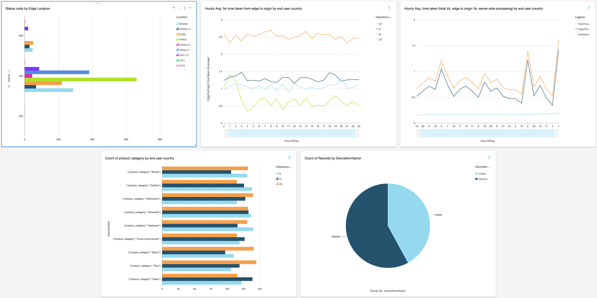

- Open the AWS Management console for Amazon QuickSight from [here](https://eu-west-1.quicksight.aws.amazon.com/sn/start)

### Signing Up for Amazon Quicksight Standard Edition

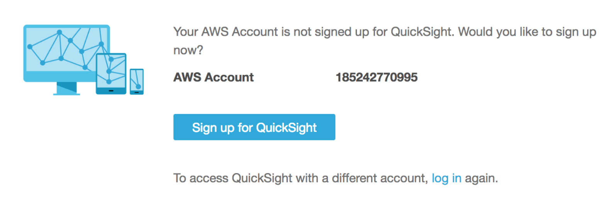

- If this is the first time you are accessing QuickSight, you will see a sign-up landing page for QuickSight.
- Click on **Sign up for QuickSight**.

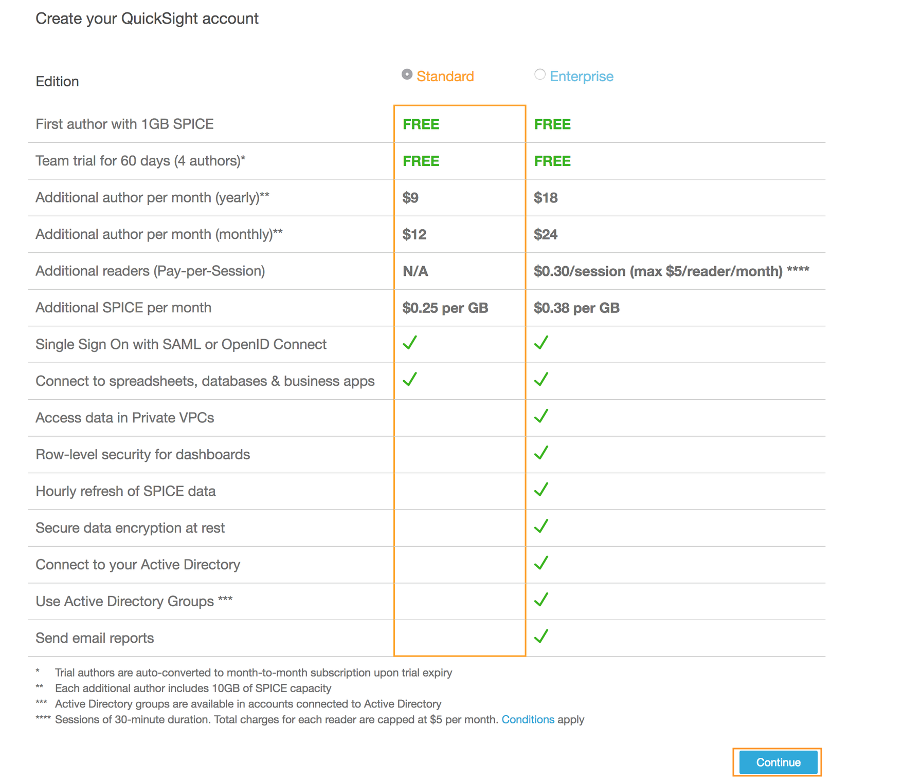

- On the **Create your QuickSight account** page, select **Standard Edition** for the subscription type. 
- Click **Continue**

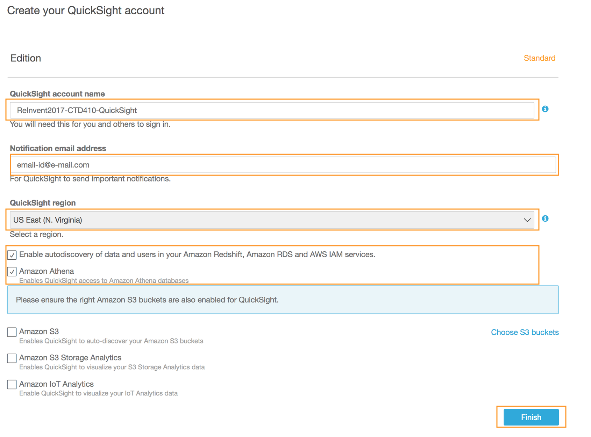

- On the next page, type a unique **QuickSight account name** 
- Type a valid email id for **Notification email address**
- Just for this step, ensure that **US East(N. Virginia)** is selected from the drop down menu for *QuickSight capacity region*
- Ensure that boxes next to **Enable autodiscovery of your data and users in your Amazon Redshift, Amazon RDS and AWS IAM Services** and **Amazon Athena** are checked
- Click **Finish**
- Wait until the page with message **Congratulations! You are signed up for Amazon QuickSight!** on successful sign up is presented. 
- Click on **Go to Amazon QuickSight**.

### Configure Amazon S3 bucket Permission

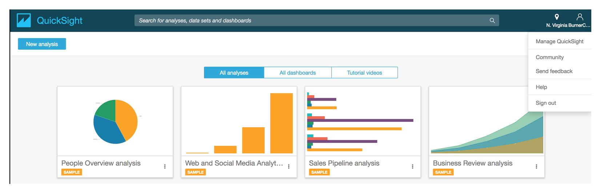

- On the Amazon QuickSight dashboard, navigate to User Settings page on the Top-Right section and click *Manage QuickSight*.

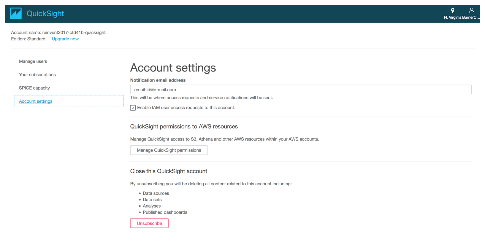

- On the next page, click on **Account Settings**
- Click on **Manage QuickSight permissions**
- Click **Choose S3 buckets** to select the Amazon S3 buckets for which auto-discovery needs to be enabled for QuickSight

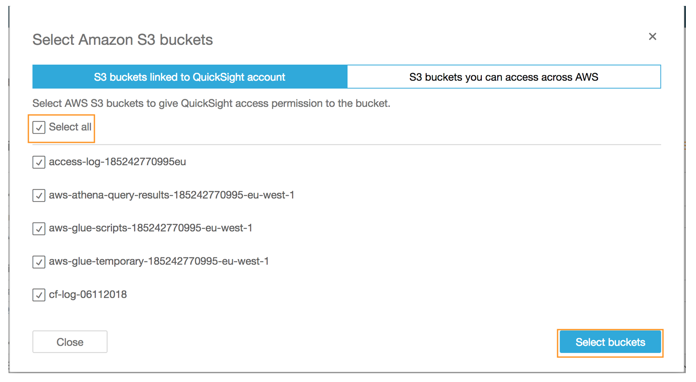

- On the pop up *Select Amazon S3 buckets *page check the box next to* Select all *or the name of the Amazon S3 bucket you created at the beginning of the lab
-  Click **Select buckets**
- Ensure that the box next to *Amazon S3 *is checked
- Click **Apply**

### Configuring Amazon Quicksight to use Amazon Athena as data source

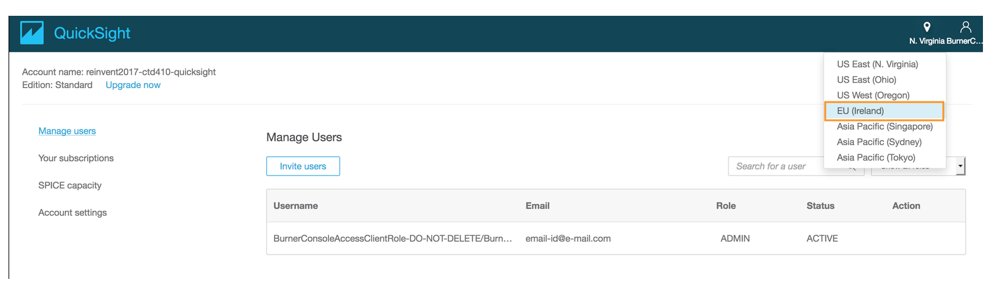

- Select **EU(Ireland)** as the region for this lab
- Click on **Manage data** in the upper right hand corner
- Click on **New data set** on the upper left hand corner

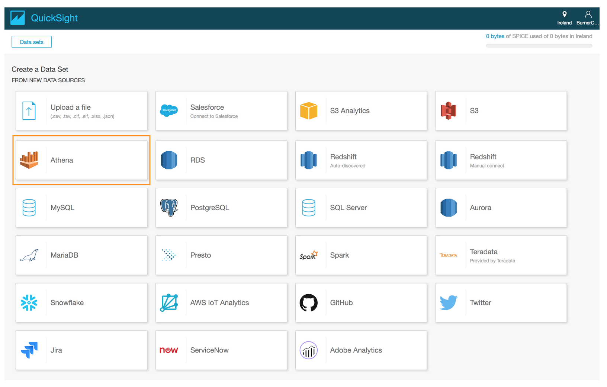

- Select **Athena** as the data source 

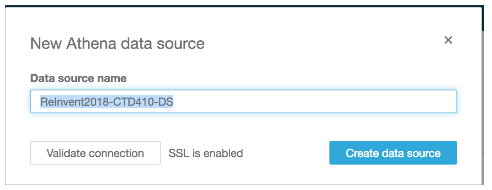

- Type a **Data source name** *(e.g. ReInvent-CTD410-DS)*
- Click on **Create data source**

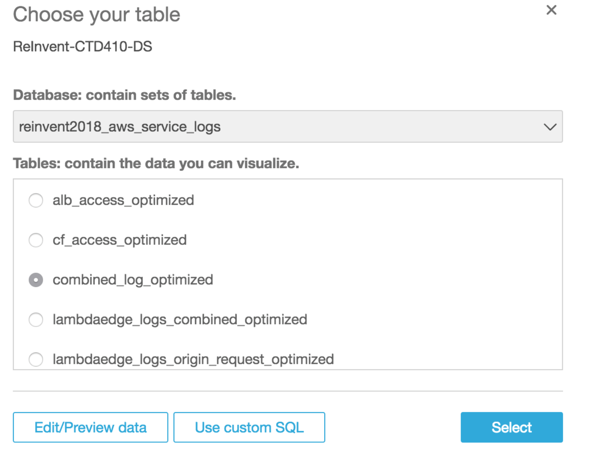

- Select **reinvent2018_aws_service_logs** from the drop down menu for **Database: contain sets of tables**
- Choose **combined_log_optimized** from the list under **Tables: contains the data you can visualize**
- Click **Edit/Preview data**

> Note: This is a crucial step. Please ensure you choose Edit/Preview data.

### Create new calculated fields “EdgeToOriginTimeTaken” in Amazon QuickSight

- Under *Fields* on the left column, click **New field**

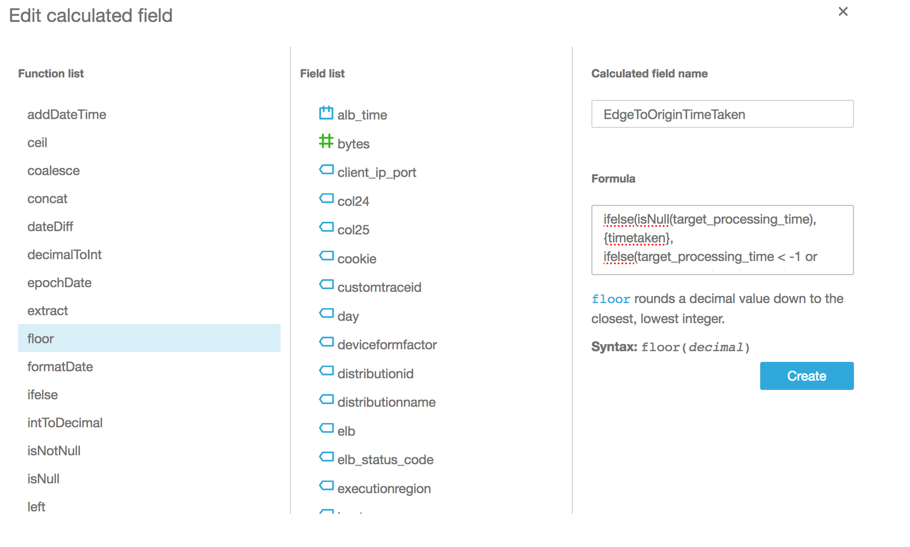

- In the *Add calculated field *pop up page, type **EdgeToOriginTimeTaken** under **Calculated field name**
- Copy and paste the formula below in the **Formula** text box

```$xslt
ifelse(isNull(target_processing_time), {timetaken}, ifelse(target_processing_time < -1 or response_processing_time < -1 or request_processing_time < -1, 0, {timetaken} - {target_processing_time} + {response_processing_time} +{request_processing_time}))
```

-Click **Create**
-Ensure that **#EdgeToOriginTimeTaken** appears under *Calculated fields*

### Create new calculated fields "HourOfDay" in Amazon QuickSight

- Under **Fields** on the left column, click **New field**
- In the **Add calculated field** pop up page, type **HourOfDay** under **Calculated field name**
- Copy and paste the formula below in the *Formula* text box

```$xslt
extract("HH",{time})
```

- Click **Create**
- Ensure that **#HourOfDay** *appears under **Calculated fields**

### Create new calculated fields "TotalTimeTakenAtALB" in Amazon QuickSight

- Under **Fields** on the left column, click **New field**
- In the **Add calculated field** pop up page, type **TotalTimeTakenAtALB** under **Calculated field name**
- Copy and paste the formula below in the **Formula** text box

```$xslt
ifelse(isNull(target_processing_time), 0, ifelse(target_processing_time < -1 or response_processing_time < -1 or request_processing_time < -1, 0, {target_processing_time} + {response_processing_time} +{request_processing_time}))
```

- Click **Create**
- Ensure that **#TotatlTimeTakenAtALB** appears under **Calculated fields**
- Click on **Save & visualize** on the top of the page


### Generate visualization to show hourly average time taken between edge and origin by country where the end user request originated from

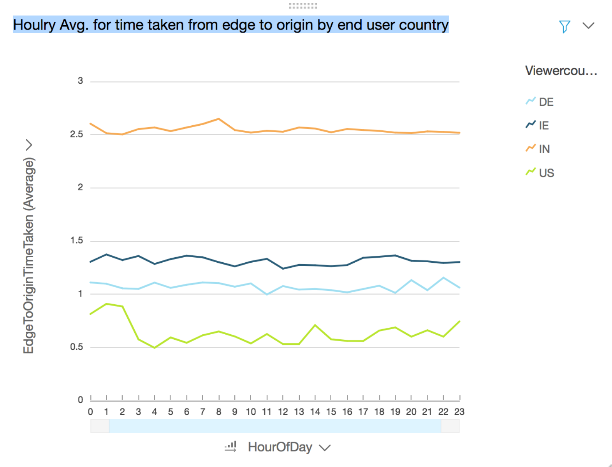

- Ensure that the selected region is **Ireland** in top right corner
- Click the *Filter *icon in the QuickSight navigation pane 
- Click on **+** symbol next to **Applied Filters**
- Select **day** field in the pop up menu


- Choose the new filter that you just created by clicking on filter name **day**
- Wait for QuickSight to load the filter values and then check the box next to one of the values for the day field *(e.g. 4)*  
- Click **Apply**
- Click **Close**
- Click again on **+** symbol next to **Applied Filters** to add another filter
- Select **viewercountry** field in the pop up menu
- Choose the new filter that you just created by clicking on filter name **viewercountry**
- Select all the values **(DE, IE, IN, US)** except **NULL**
- Click **Apply**
-  Click **Close**
-  Click again on **+** symbol next to **Applied Filters** to add another filter
-  Select **responseresulttype** field in the pop up menu
-  Choose the new filter that you just created by clicking on filter name **responseresulttype**
-  Select **Miss** from the list of values
-  Click **Apply**
-  Click **Close**

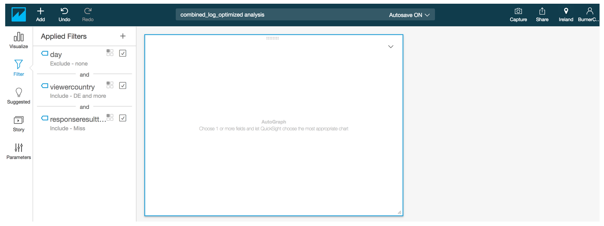

- Click the **Visualize** icon in the QuickSight navigation pane

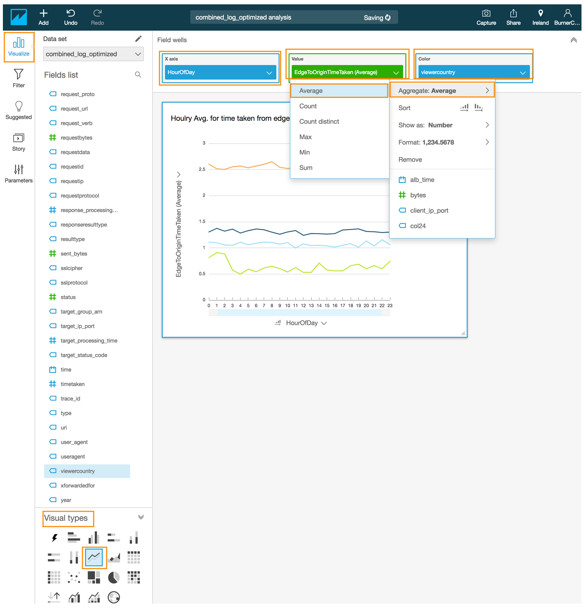

- Select the Line chart under **Visual types** 
- Drag and drop the **#HourofDay** field into the **X axis** in the **Field wells** section on the top 
- Drag and drop the **viewercountry** field into the **Color** in the **Field wells** section 
- Drag and drop the **#EdgeToOriginTimeTaken** field into the **Value** in the **Field wells** section
- Click on the down arrow next to **EdgeToOriginTimeTaken** in the Value to reveal a sub-menu
- Select **Aggregate:** and select **Average**

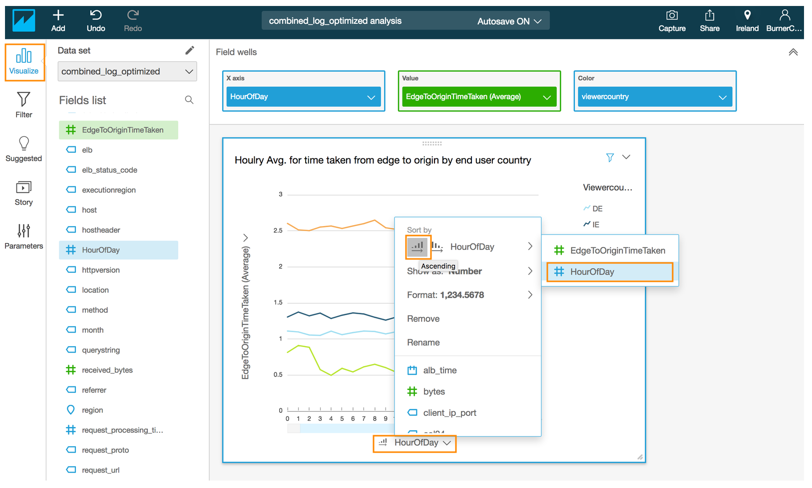

- Click on the drop down arrow next to **HourOfDay** in the x-axis of the chart to reveal a sub menu.
- Click on the Ascending order next to **HourOfDay** under **Sort by** in the revealed menu
- Edit the title by click on the title in the chart to **Houlry Avg. for time taken from edge to origin by end user country** (optional)

### Generate visualization to show hourly average time taken (total Vs. edge to origin Vs. server-side processing) by country where the end user request originated from

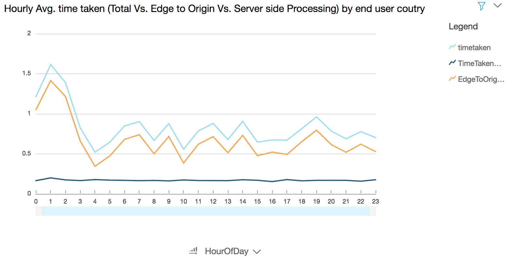

- Click on *Add *from the QuickSight menu on the top to **Add Visual** from the pop up menu
- Ensure that the selected region is **Ireland** in top right corner
- Click the **Filter** icon in the QuickSight navigation pane 
- Click on **+** symbol next to **Applied Filters**
- Select **day** field in the pop up menu
- Choose the new filter that you just created by clicking on filter name **day**
- Wait for QuickSight to load the filter values and then check the box next to one of the values for the day field (*e.g. 4 same day that you selected in the previous chart*)  
- Click **Apply**
- Click **Close**
-  Click again on **+** symbol next to **Applied Filters** to add another filter
-  Select **viewercountry** field in the pop up menu
-  Choose the new filter that you just created by clicking on filter name **viewercountry**
-  Select one of the values (e.g. **US**) except **DE**
-  Click **Apply**
-  Click **Close**
-  Click again on **+** symbol next to **Applied Filters** to add another filter
-  Select **responseresulttype** field in the pop up menu
-  Choose the new filter that you just created by clicking on filter name **responseresulttype**
-  Select **Miss** from the list of values
-  Click **Apply**
-  Click **Close**

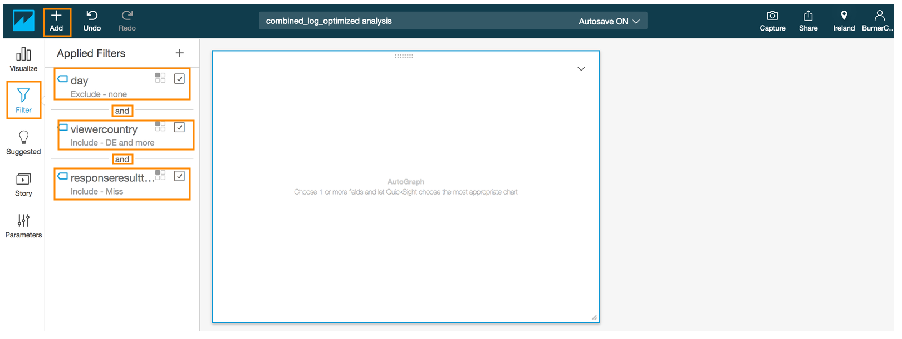

- Click the **Visualize** icon in the QuickSight navigation pane

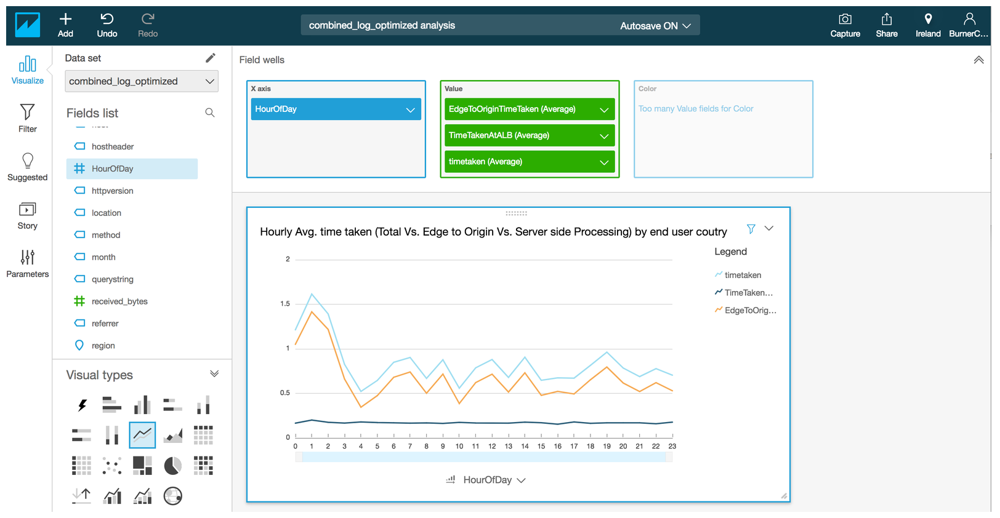

- Select the Line chart under **Visual types** 
- Drag and drop the **#HourofDay**field into the **X axis** in the **Field wells** section on the top 
- Drag and drop the **#EdgeToOriginTimeTaken** field into the **Value** in the **Field wells** section
- Click on the down arrow next to **EdgeToOriginTimeTaken** in the Value to reveal a sub-menu
- Select **Aggregate:** and select **Average**
- Drag and drop the **#TimeTakenAtALB**field into the **Value** in the **Field wells** section
- Click on the down arrow next to **#TimeTakenAtALB** in the Value to reveal a sub-menu
- Select **Aggregate:** and select **Average**
- Drag and drop the **#timetaken** field into the **Value** in the **Field wells** section
- Click on the down arrow next to **#timetaken** in the Value to reveal a sub-menu
- Select **Aggregate:** and select **Average**
- Click on the drop down arrow next to **HourOfDay** in the x-axis of the chart to reveal a sub menu.
- Click on the Ascending order next to **HourOfDay** under **Sort by** in the revealed menu
- Edit the title by click on the title in the chart to **Hourly Avg. time taken (total Vs. edge to origin Vs. server-side processing) by end user country** (optional)

<details>
     <summary>CLICK TO EXPAND FOR OPTIONAL SECTION</summary>
  
  ### Generate visualization to show hourly average time taken (total Vs. edge to origin V.s server-side processing) by country where the end user request originated from for a different viewer country
  
  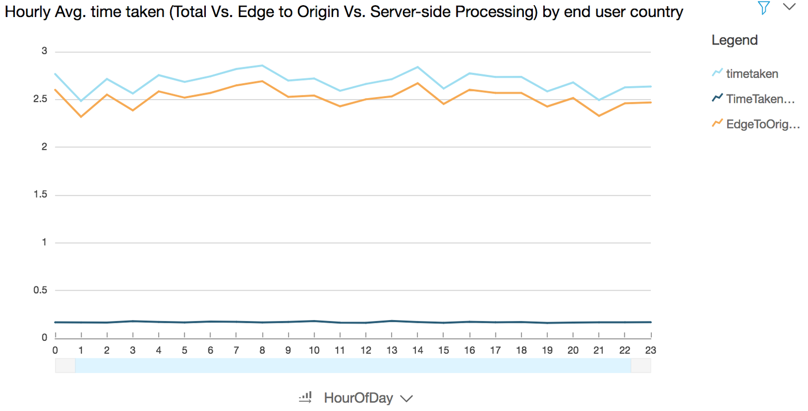
  
  - Click the **Filter** icon in the QuickSight navigation pane 
  - Choose the new filter that you just created by clicking on filter name **viewercountry**
  - Select one of the values (e.g. **IN**) except **DE**
  - Click **Apply**
  - Click **Close**
  - Click the **Visualize** icon in the QuickSight navigation pane

</details>

### Generate Visualization to show PRODUCT CATEGORY REQUEST BY Country

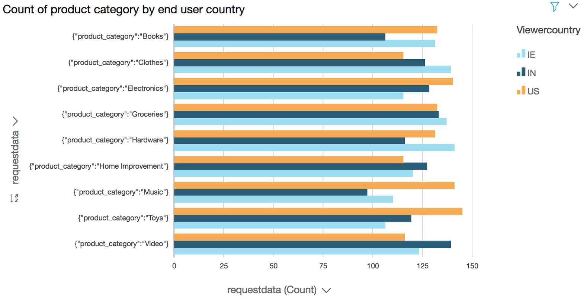

- Click on **Add** from the QuickSight menu on the top to **Add Visual** from the pop up menu
- Ensure that the selected region is **Ireland** in top right corner
- Click the **Filter** icon in the QuickSight navigation pane 
- Click again on **+** symbol next to **Applied Filters** to add another filter
- Select **requestdata** field in the pop up menu

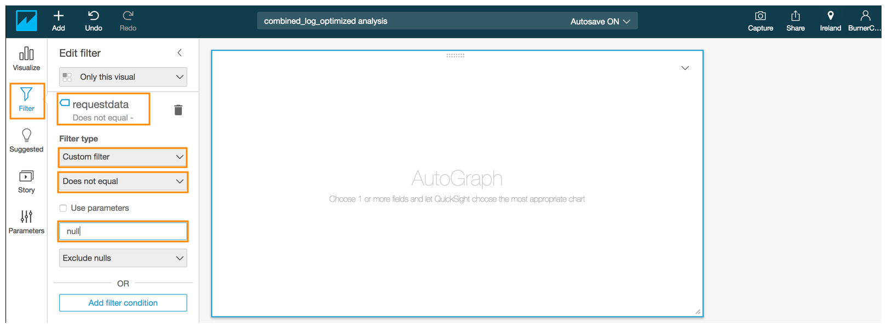

- Choose the new filter that you just created by clicking on filter name **requestdata**
- Choose **Custom filter** from the drop down for **Filter type** 
- For the second drop down under **Filter type** choose **Does not equal**
- Type *null* in the text box.
- Click **Apply**
- Click **Close**
- Click again on **+** symbol next to **Applied Filters** to add another filter
- Select **viewercountry** field in the pop up menu
- Choose the new filter that you just created by clicking on filter name **viewercountry**
- Select all the values **(DE, IE, IN, US)** except **NULL**
- Click **Apply**
- Click **Close**
- Click the **Visualize** icon in the QuickSight navigation pane


### Generate visualization to show device form factor ratio

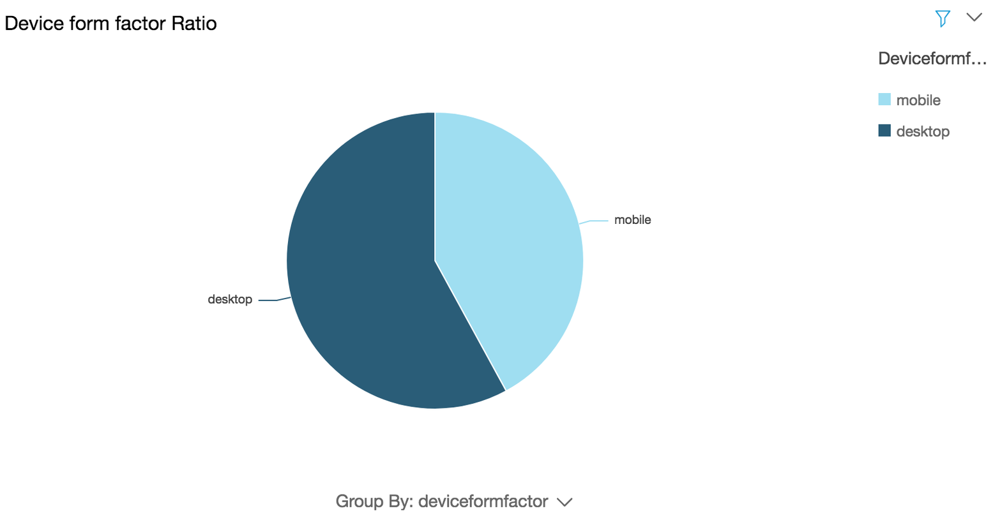

- Click on *Add *from the QuickSight menu on the top to **Add Visual** from the pop up menu
- Ensure that the selected region is **Ireland** in top right corner
- Click the **Filter** icon in the QuickSight navigation pane 
- Click on **+** symbol next to **Applied Filters**
- Select **deviceformfactor** field in the pop up menu
- Choose the new filter that you just created by clicking on filter name **deviceformfactor**
- Choose *Custom filter from the drop down for **Filter type** 
- For the second drop down under **Filter type** choose **Does not equal**
- Type *null* in the text box.
- Click **Apply**
- Click **Close**
- Click the **Visualize** icon in the QuickSight navigation pane
- Select the **Pie chart** under **Visual types** 
- Drag and drop the **deviceformfactor** field into **Group/Color** in the **Field wells** section
- Edit the title by click on the title in the chart to **Device form factor Ratio** (optional)

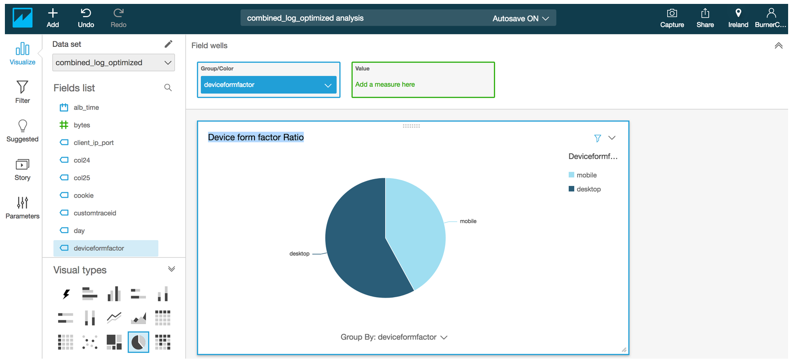

<details>
     <summary>CLICK TO EXPAND FOR OPTIONAL SECTION</summary>
     
 ### Generate visualization to show device form factor ration by viewer country
 
 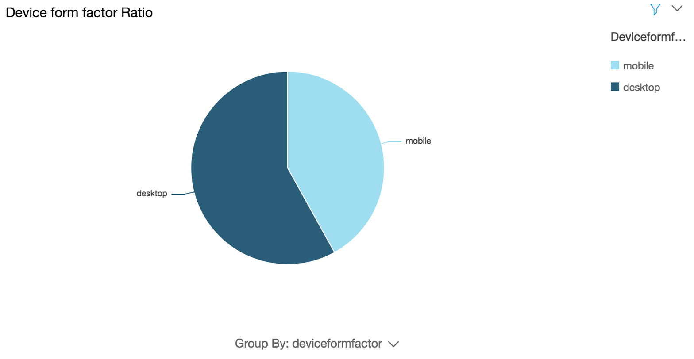
 
 - Click the **Filter** icon in the QuickSight navigation pane 
 - Choose the new filter that you just created by clicking on filter name **viewercountry**
 - Select one of the values (e.g. **IN**) except **DE**
 - Click **Apply**
 - Click **Close**
 - Click the **Visualize** icon in the QuickSight navigation pane
  
</details>

## License Summary

This sample code is made available under a modified MIT license. See the LICENSE file.